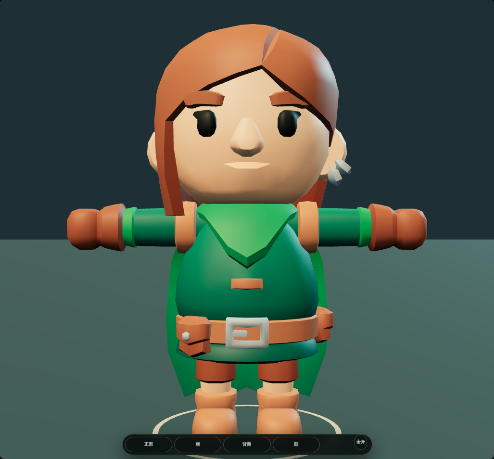
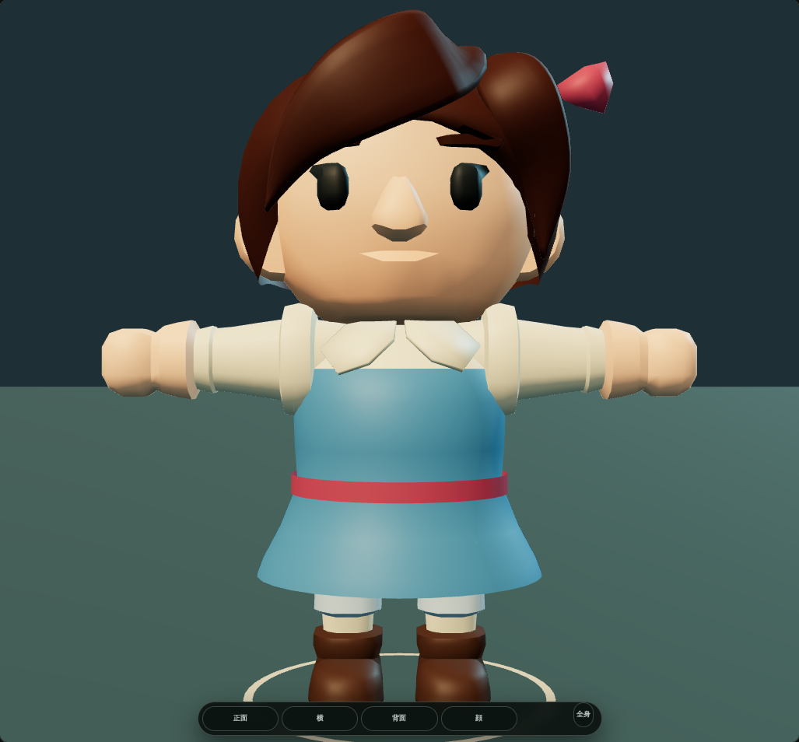
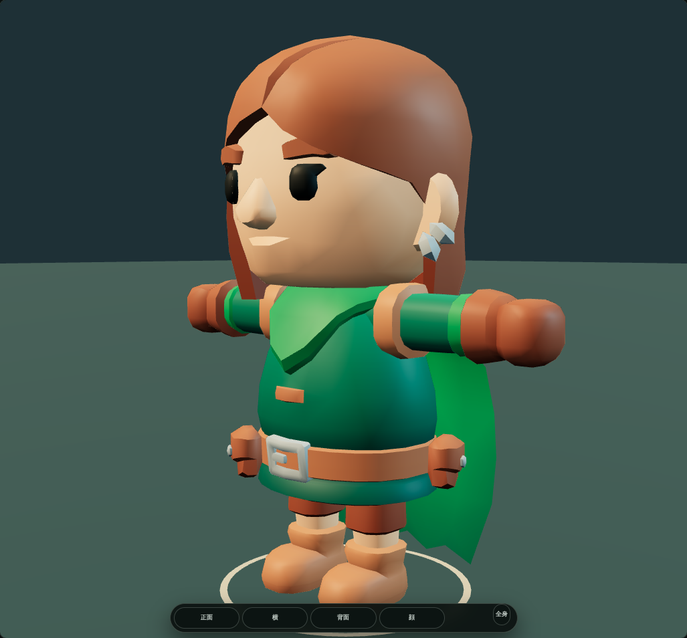
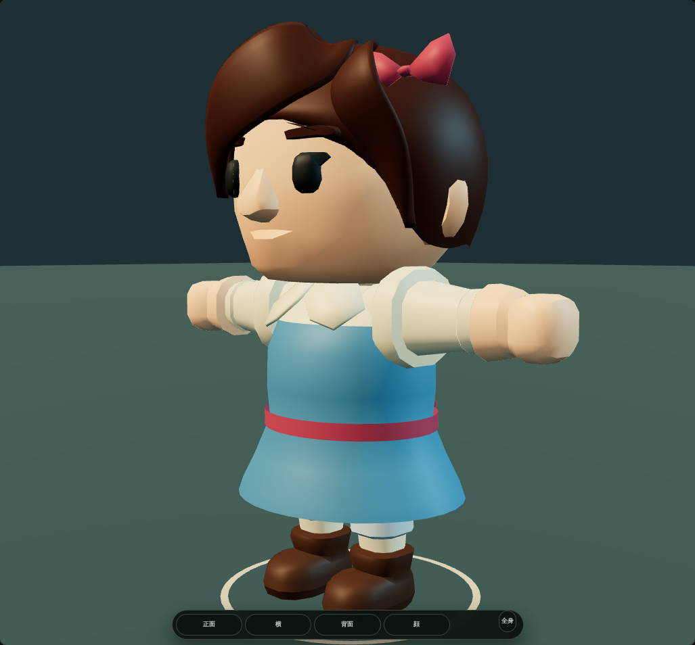
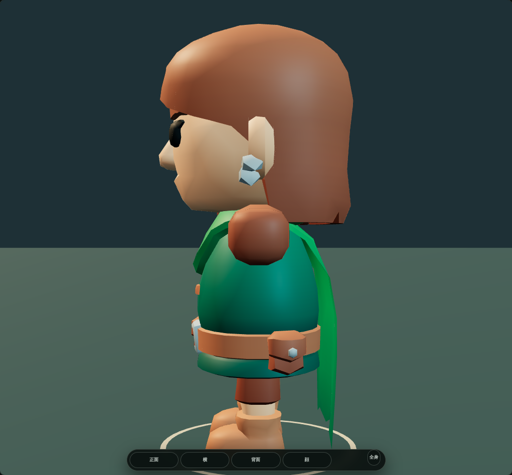
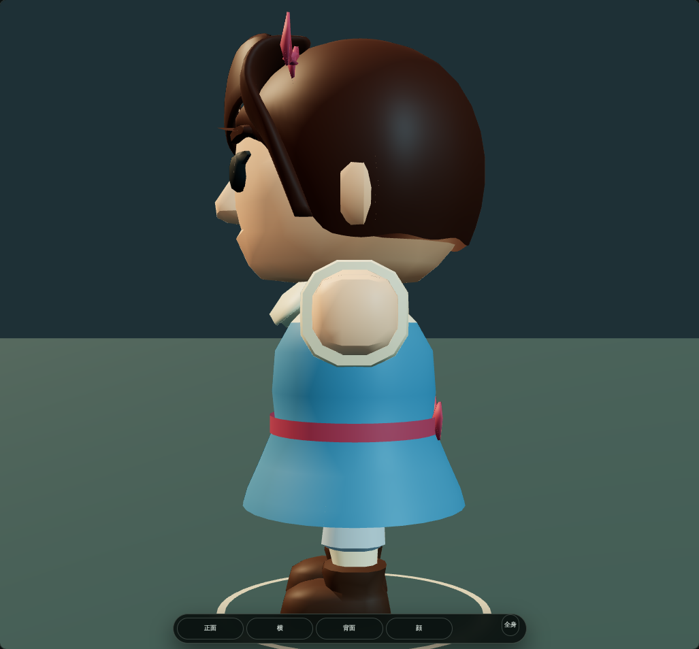
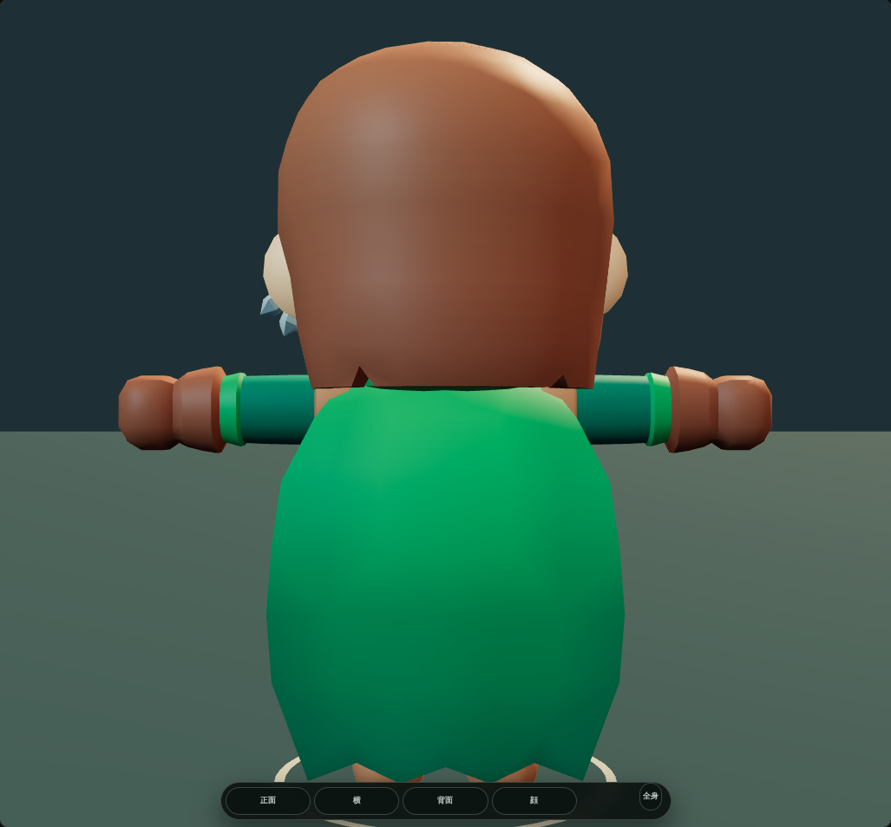
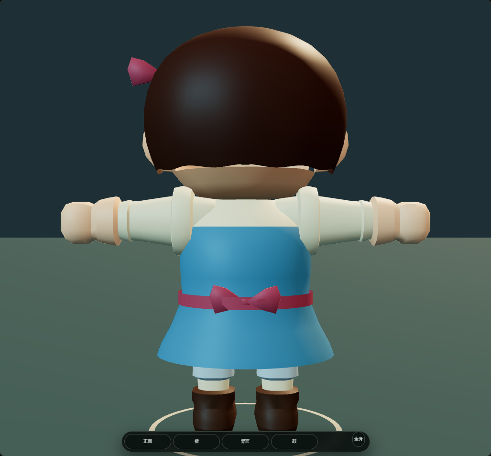
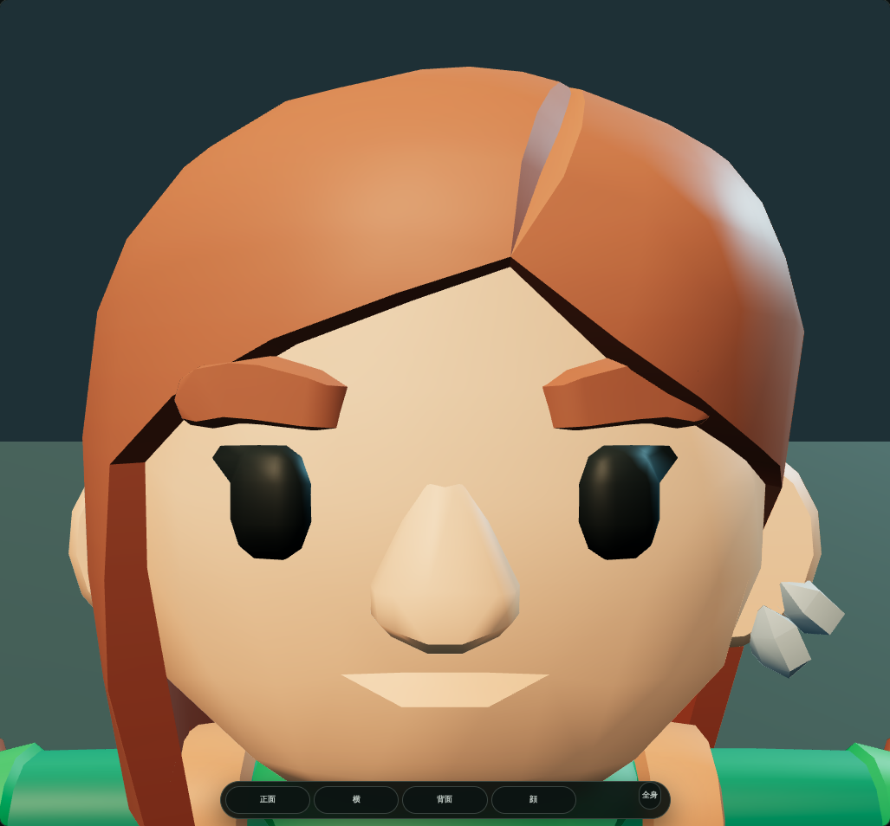
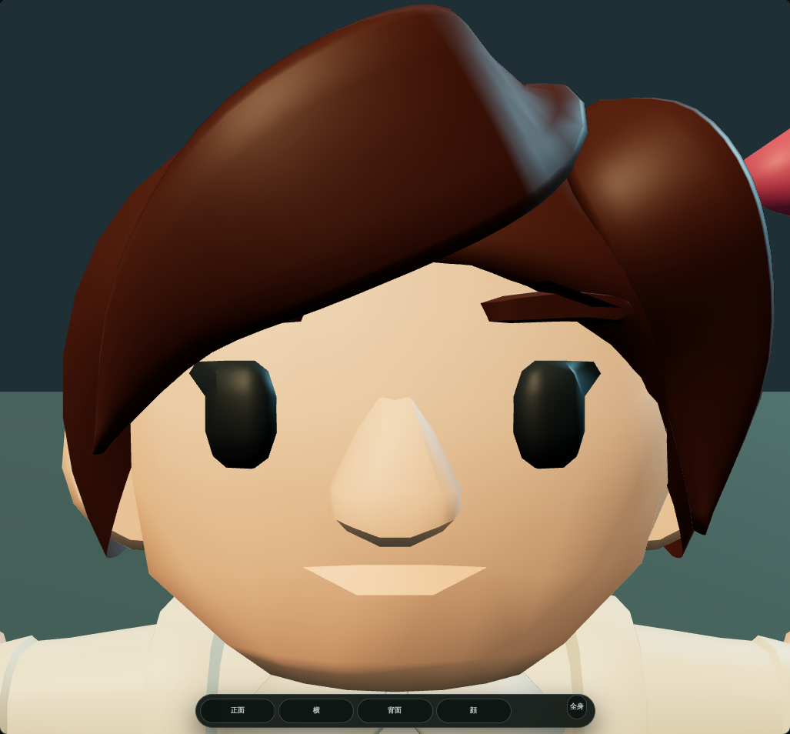

# 女主人公 Heroine Dawn — 実モデル視覚レビュー

対象: `protagonist.villager.female.v1`。起点develop: `c2e0d022bc570f8f22b94dd059e669f556a9cc3e`。2026-09-22、ユーザーが明示した実DCC編集・複数視点観察に対する作業証拠。

## 採用出力

GLB SHA-256: `777f0c4f7f910edf85ab66011fddf961b7144a4a129212cf8a0b5a1b73937678`。
Git blob: `3ced3b11942d57cd82763715c7196dfd4f53141e`。
3,987,056 bytes、表示対象6,623 triangles。Blender 4.0.2。

原本は固定CC0 KayKit Rogue。41 joint nodes、skin / inverse bind、76 clipのanimation sampler payloadを保持し、DCC exporterとfocused testが原本とのbyte比較を行う。原本を上書きせず、未採用の第2稿GLBもactive treeには残さない。

## 実編集と審美レビュー

第1稿は丸いボブ・流し前髪・白い襟と袖・青い村人服を制作したが、元の小物を除去した胴の穴、前髪の硬い角が実レンダーで見つかったため不採用。

第2稿では衣装を連続した面へ再構成し、元の身体からskin weightを転送した。髪の曲面と顔の法線も修正。固定5視点では穴を解消したが、実Character StudioのWalking_A 28%で裾に小さな短パンの突出を確認した。

第3稿では腰下128頂点の衣装外形に歩行用の余裕を付け、同じ実レンダー条件・同じ歩行位相で再確認した。28%の突出が消え、72%、待機、攻撃、防御、被弾の取得画像でも同じ貫通は見えない。骨・weight・既存clipは変更していない。

正面では流し前髪と白い襟、斜め・横では丸い顎丈ボブと裾、背面では短いボブとリボンがRogueの長髪・ケープと異なる。髪・衣装の色だけでなく、輪郭と小物構成が別人の識別点になっている。原作者の低ポリ顔・手足の作風は保った。

## Character Studioの実画像

同一の実アプリrendererで原本と採用GLBを読み、実際の選択カードから女主人公を選んで撮影した。

| 視点 | 比較元Rogue | 女主人公 |
| --- | --- | --- |
| 正面・全身 |  |  |
| 斜め・全身 |  |  |
| 横 |  |  |
| 背面 |  |  |
| 顔寄り |  |  |

動作画像: `motion-Idle-50.png`、`motion-Walking_A-28.png`、`motion-Walking_A-72.png`、`motion-1H_Melee_Attack_Chop-47.png`、`motion-Block-50.png`、`motion-Hit_A-40.png`。すべて`runtime/`内。実UI全体は`studio-ui.png`、狭幅表示は`mobile-390.png`。Blender固定照明の画像は`dcc-*.png`。

## 観察条件と証拠の境界

最終観察run: `35686182428`、artifact: `10677231787`。
Runner checkout/authoring instructions: `dc7e8a24a962ab9ddf0988ba77740b8567ef42f4`。
生成binary・receipt・PNGを収録したcommit: `90b8026086c0a88ec6a8c42451e546d4865b69c1`。

`runtime/receipt.json.sourceSha` はrunnerのcheckoutを指す。そこで生成・統合したworking-treeのモデルを観察してから収録しており、観察対象binaryは`modelSha256`で厳密に識別する。最終の文書・test・freshness reconciliationでモデルbytesは変えない。

実行はAPP_ENV=devでbuildしたCharacter StudioのVite / Chromium SwiftShader。project-origin要求を同一checkoutの自前配信用実体へrouteした。公開DEVの配信完了を示す証拠ではなく、第三者runtime CDNや生成画像による代用でもない。

page/console errors、warningsは空。実GLB内の5種類・6位相のclipをAnimationMixerで適用し、各位相で骨の変化と942サンプルの有限なskin変形座標を記録した。全76クリップや全装備の総当たり確認、実機fps計測ではない。390pxはviewport確認でありPixel Fold実機性能の測定ではない。

実モデルの見た目確認はこのタスクで実施したが、human visualApprovalは自己発行しない。PRIMARY / visualApproval=pending / productionReady=false。一時DCC/搬送/観察workflowは最終validation前に削除し、常設Fast DEVへ重い観察を追加しない。
